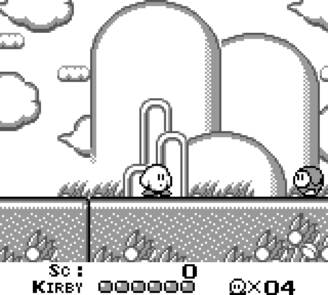
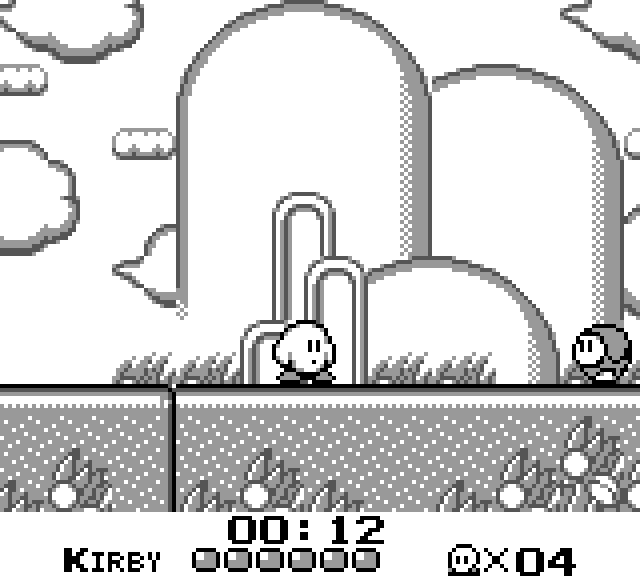
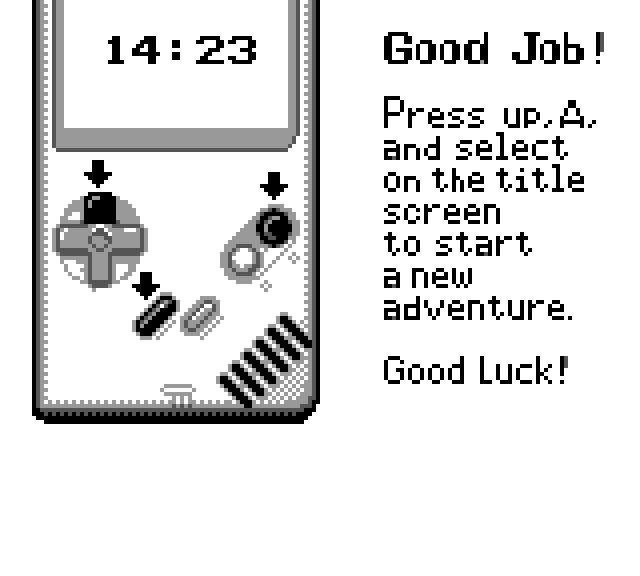

# Kirby's Speedrun

This unofficial mod for Kirby's Dream Land replaces the in-game score display with a speedrun timer. It begins when you press START on the title screen, and ends when you land the final blow on King Dedede.

<table align="center">
	<tr>
		<th>Vanilla</th>
		<th>Patched</th>
	</tr>
	<tr>
		<td></td>
		<td></td>
	</tr>
	<tr>
		<td></td>
		<td></td>
	</tr>
</table>

Over the course of a run, gameplay may drift from vanilla by a few frames, so consider this a practice tool rather than an authoritative timekeeper.

## Bring your own ROM

No ROM is distributed here. You must provide your own, legitimate copy of the ROM to use this mod. Products like Epilogue's [GB Operator](https://www.epilogue.co/product/gb-operator) may help you create archival backups of Game Boy software you legally own.

Patching is performed [in your web browser](https://hunterirving.github.io/kirbys_speedrun), and no files ever leave your device.

To patch with another tool, [download the IPS patch](https://github.com/hunterirving/kirbys_speedrun/raw/main/kirby%27s_speedrun.ips) directly.

## Disclaimer

This is an unofficial fan project. It is not affiliated with, sponsored by, or endorsed by Nintendo or HAL Laboratory.

Kirby, Kirby's Dream Land, and Game Boy are trademarks of Nintendo. Kirby's Dream Land is © 1992 HAL Laboratory, Inc. / Nintendo.
